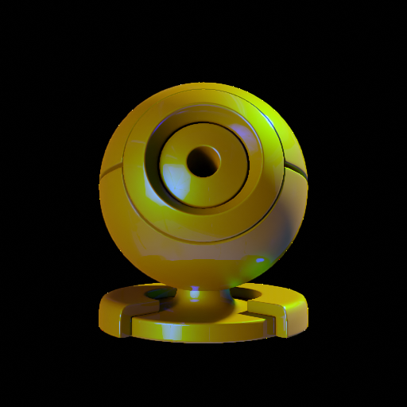
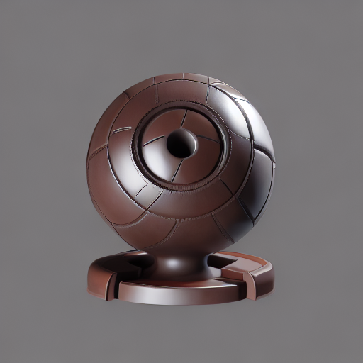
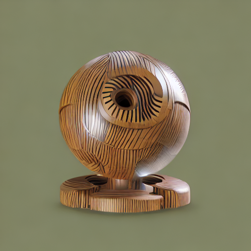
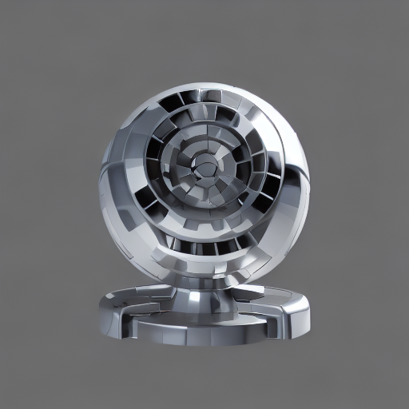

# FlashTex: Fast Relightable Mesh Texturing with LightControlNet

[**Project**](https://flashtex.github.io/) | [**Paper**](https://arxiv.org/abs/2402.13251)

ECCV 2024, Oral

 [Kangle Deng](https://dunbar12138.github.io/),
 [Timothy Omernick](),
 [Alexander Weiss](),
 [Deva Ramanan](https://www.cs.cmu.edu/~deva/),
 [Jun-Yan Zhu](https://www.cs.cmu.edu/~junyanz/),
 [Tinghui Zhou](),
 [Maneesh Agrawala](https://graphics.stanford.edu/~maneesh/)

Roblox, Carnegie Mellon University, Stanford University

https://github.com/user-attachments/assets/f5598c0b-94c0-48b7-a809-d75750a2a8fc

Manually creating textures for 3D meshes is time-consuming, even for expert visual content creators. We propose a fast approach for automatically texturing an input 3D mesh based on a user-provided text prompt. Importantly, our approach disentangles lighting from surface material/reflectance in the resulting texture so that the mesh can be properly relit and rendered in any lighting environment. Our method introduces LightControlNet, a new text-to-image model based on the ControlNet architecture, that allows the specification of the desired lighting as a conditioning image to the model. Our text-to-texture pipeline then constructs the texture in two stages. The first stage produces a sparse set of visually consistent reference views of the mesh using LightControlNet. The second stage applies a texture optimization based on Score Distillation Sampling (SDS) that works with LightControlNet to increase the texture quality while disentangling surface material from lighting. We show that this pipeline is significantly faster than previous text-to-texture methods, while producing high-quality and relightable textures.

## Getting Started

### Dependencies

Our environment has been tested on linux, pytorch 2.0, and CUDA 11.8.

1. Install pytorch and CUDA.
2. Install pytorch3d following [link](https://github.com/facebookresearch/pytorch3d/blob/main/INSTALL.md).
3. Install other requirements:
```
pip install -r requirements.txt
```

---
### Inference with Depth ControlNet (No PBR)

```
python generate_texture.py --input_mesh ./load/examples/horse_saddle_compressed.obj \ 
                           --output ./output/horse_saddle/ \
                           --prompt "horse saddle, leather, craft, sewing, tanning, 20-th century, best quality, hd" \
                           --rotation_y 180 \
```

Explanation for some primary parameters:
- `input_mesh`: We currently support `.obj` and `.glb` files. We provide several samples in `load/examples`.
- `output`: The directory to save output. The script will automatically create non-exisiting ones.
- `prompt`: Input text prompt. We also support additional `a_prompt` and negative prompts `n_prompt`.
- `rotation_y`: Rotate the mesh along y (up) axis. We set this parameter as the example mesh is initially back-facing.
- `production`: Use this flag to skip saving intermediate results and final gifs to save running time.

Please refer to `generate_texture.py` for other parameters. The script will export the textured mesh and visualizations to `<output>` directory. Specifically, `output_mesh.obj` is the normalized mesh, `output_mesh.mtl` and `texture_kd.png` are exported textures. You will also get the output gif as below:


### Inference with LightControlNet

We have uploaded our pre-trained lightcontrolnet weights to huggingface at [link](https://huggingface.co/kangled/lightcontrolnet/). With the `controlnet_name` specified as `kangled/lightcontrolnet`, the scripts will automatically download the weights. 

#### 2D Generation with LightControlNet

You can run the script below to run LightControlNet on a prepared control image, and get the following results:

```
python tools/test_controlnet.py
```

| Input Control Image | "Leather" | "Wooden"  | "Steel" |
| --- | --- | --- | --- |
|  |  |  | 

#### Run texture generation with pre-trained lightcontrolnet

```
python generate_texture.py --input_mesh ./load/examples/horse_saddle_compressed.obj \ 
                           --output ./output/horse_saddle_pbr/ \
                           --prompt "horse saddle, leather, craft, sewing, tanning, 20-th century, best quality, hd" \
                           --rotation_y 180 \
                           --guidance_sds LightControlNet --pbr_material \
                           --controlnet_name kangled/lightcontrolnet
```

Besides `texture_kd.png`, you will also find `texture_roughness.png`, `texture_metallic.png`, and `texture_nrm.png` in the output directory. You will also get gifs output as below:

 

Left: Rotating Object with the fixed lighting. Right: Fixed Object with the rotating lighting.

---

### Train your own LightControlNet

You can also train your own LightControlNet with your own prepared data. We provide the instructions below.


#### Install Blender

You first need to download and Install Blender:
```
wget https://download.blender.org/release/Blender3.2/blender-3.2.2-linux-x64.tar.xz
tar -xf blender-3.2.2-linux-x64.tar.xz
rm blender-3.2.2-linux-x64.tar.xz
export PATH=$PATH:path_to_blender/blender-3.2.2-linux-x64/
```

#### Render training data

To render control images for a single object, we provide a blender script and example usage below:
```
blender -b -P tools/blender_script.py -- \
            --object_path {obj_path} \
            --output_dir {save_path} \
            --num_renders 4 \
            --engine CYCLES \
```

We provide an example script `tools/distributed_render_objaverse.py` to distribute the blender rendering process of staffpicked subset in Objaverse as rendering the whole dataset takes a lot of time. Please change the corresponding data and rendering directory before running it.

#### Build ControlNet Training Set

Once the images are rendered, the dataset can be built by running `tools/make_controlnet_dataset_optim.py`. This script will create a list `train.jsonl` in the rendered directory indicating the metadata.
After running the script, copy `tools/objaverse_render.py` to your data root dir to make it a readable dataset. Please change the corresponding data and rendering directory accordingly.

Example file tree:
```
rendered_data
├── staffpicked
│   ├── 00200996b8f34f55a2dd2f44d316d107 # Rendered Object
│   │   ├── 000_rgb.png
│   │   └── ...
│   ├── ...        
│   └── train.jsonl
├── subsetB
│   └── ...
├── ...
└── objaverse_render.py
```

#### Training

We follow the diffusers library's ControlNet training script ([link](https://github.com/huggingface/diffusers/blob/main/examples/controlnet/train_controlnet.py)). We train our lightcontrolnet based on the weights from a pretrained depth controlnet.

A few extra dependencies need to be installed following the [instructions](https://github.com/huggingface/diffusers/tree/main/examples/controlnet#installing-the-dependencies). We provide an example training script below. Please refer to [instructions](https://github.com/huggingface/diffusers/tree/main/examples/controlnet) for multi-gpu training.

```
export MODEL_DIR="stable-diffusion-v1-5/stable-diffusion-v1-5"
export LOAD_CKPT="lllyasviel/control_v11f1p_sd15_depth"
export OUTPUT_DIR="path to save model"
export DATA_PATH="path to the data"

accelerate launch train_controlnet.py \
 --pretrained_model_name_or_path=$MODEL_DIR \
 --controlnet_model_name_or_path=$LOAD_CKPT \
 --output_dir=$OUTPUT_DIR \
 --dataset_name=$DATA_PATH \
 --resolution=512 \
 --learning_rate=1e-5 \
 --train_batch_size=4
```

## FAQs

***Q1***: *I'm not getting good results.*

Make sure you follow the guidelines and walk through the questions below. In general, results with depth ControlNet are visually better than lightcontrolnet as the depth one is trained on much more data.

***Q2***: *Baked-in lighting still exists in generated albedo.*

Our method is trained without PBR data. It is difficult to recover perfect PBR materials without data priors. Sometimes tuning down `lambda_recon_reg` can alleviate this problem.

***Q3***: *Why do the generated visuals look different from yours on the website?*

Some of our videos on our website are rendered using Blender. You can import the generated texture into Blender using its built-in function.

***Q4***: *I'm getting over-saturated color.*

Using a larger `lambda_recon_reg` or a smaller `guidance_scale` can help.

***Q5***: *The running time is longer than expected.*

The initial run takes significantly longer as it requires downloading pre-trained weights and compiling certain components. Once completed, subsequent runs will execute at normal speed. Additionally, generating intermediate outputs, such as videos, adds to the processing time. To speed up the process, you can use the `--production` flag to disable these intermediate outputs and only generate the final result. Additionally, the running time is also dependent on the size of the input mesh as meshes with more vertices and faces require longer time to load, render, and export.

***Q6***: *There is an external package `threestudio`. Is it different from [threestudio](https://github.com/threestudio-project/threestudio)?*

Yes. While our codebase is heavily based on threestudio, we did make a few changes within the package, e.g., add customized environment lighting support in PBR materials.

## Citation

If you find this repository useful for your research, please cite the following work.
```
@inproceedings{deng2024flashtex,
  title={FlashTex: Fast Relightable Mesh Texturing with LightControlNet},
  author={Deng, Kangle and Omernick, Timothy and Weiss, Alexander and Ramanan, Deva and Zhu, Jun-Yan and Zhou, Tinghui and Agrawala, Maneesh},
  booktitle={European Conference on Computer Vision (ECCV)},
  year={2024},
}
```


## Acknowledgments
We thank Benjamin Akrish, Victor Zordan, Dmitry Trifonov, Derek Liu, Sheng-Yu Wang, Gaurav Parmer, Ruihan Gao, Nupur Kumari, and Sean Liu for their discussion and help. This work was done when Kangle was an intern at Roblox. The project is partly supported by Roblox. JYZ is partly supported by the Packard Fellowship. KD is supported by the Microsoft Research PhD Fellowship. 

Part of this codebase borrows from [threestudio](https://github.com/threestudio-project/threestudio), [stable-dreamfusion](https://github.com/ashawkey/stable-dreamfusion), and [objaverse](https://github.com/allenai/objaverse-xl/tree/main/scripts/rendering).
